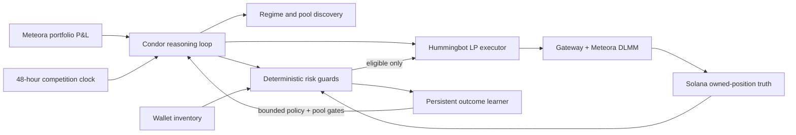

# Agent Builders Cup submission — copy-ready draft

Prepared for the **Meteora** team. Botcamp applications close and code freezes on
**August 31, 2026**. The finals run for **48 hours** with $800 USDC per agent. Official
scoring is **40% volume**, **40% P&L**, and **20% HBOT vote**. Each category is
**rank-normalized**: first receives 12 points and last receives 1. Volume means gross filled
notional; trading fees are paid from the same $800 account and therefore reduce final P&L.

## Portal fields

**Project name:** Regime LP Operator

**Tagline:** A chain-verified Meteora agent that adapts DLMM liquidity to market regime and
refuses to trust an execution result until Solana agrees.

**Team preference:** Meteora — rank first

**Agent type:** Condor Agent

**Venue:** Solana / Meteora DLMM, with Jupiter for required residual swaps

**Repository:** `https://github.com/cryptoclassdev/condor/tree/meteora-cup`

**Demo video:** `<DEMO_VIDEO_URL>`

## Strategy description for the application

Regime LP Operator is an autonomous Meteora DLMM agent built for a problem that begins after
most LP demos end: keeping the capital safe when the RPC, executor registry, position cache,
wallet and protocol view disagree.

The agent splits actual risk capital into three independent sleeves. **Core** provides
SOL/USDC liquidity in deeper pools. **Satellite** enters gated SOL-quoted pools only after
liquidity, regime and token-safety checks. **Runner** searches young Meteora pools for
accelerating five-minute volume and uses short maximum holds. Users choose Guardian,
Balanced or Hunter at startup; sleeve budgets, reserves, daily-loss limits and drawdown rules
remain deterministic and cannot be overridden by the LLM.

Every minute, four guards run independently of market discovery. Orphan Guard reconciles
RUNNING LP executors with Solana-owned positions. Wallet Audit finds liquid quote and stranded
tokens. Capital Guard values wallet plus LPs in USD and deducts gas and refundable position
rent before sizing. Lifecycle Guard enforces exact UTC deadlines, stop proximity and material
inventory changes. Every create and close is verified in both directions. A reported success
without a chain or wallet delta remains unverified; a reported failure with a live position is
adopted instead of duplicated.

A bounded outcome-learning routine can turn reconciled facts into structured evidence instead
of relying on prose memory. It distinguishes same-tick indexing lag, false success,
false-failure orphans, insufficient exact-token balance, invalid ranges, RPC failures and
strategy stop-losses. Repeated proof may adjust only bounded execution mechanics—funding
haircut, range width and RPC backoff—while hard risk controls remain outside its interface.
Stop-loss pools receive an expiring cooldown before fresh discovery can admit them again. Its
pure policy and durable ledger are tested; deterministic host-level capture of every action is
a pre-freeze integration item, so the submission does not claim self-modification or guaranteed
automatic improvement.

The agent changes DLMM distribution and width from measured volatility regime: concentrated
Curve liquidity in calm conditions, quote-side Bid-Ask liquidity below price in ranging or
rising markets, defensive width or no entry when unstable. Missing data is never converted to
zero. Performance comes from Meteora's own portfolio accounting rather than deposit notional or
executor self-reporting.

This is already running against Meteora on Solana mainnet. Live operation exposed two upstream
close-path defects, false-success creates/stops, stale OPEN cache rows, partial wallet reads and
rate-limit failure modes. Those failures became recovery logic and regression tests. The result
is not a promise of risk-free yield; it is an agent designed to keep reasoning correctly when
the infrastructure gives contradictory answers—and to remain alive and controlled through the
full 48-hour race.

The finals clock is deterministic. New entries stop with 135 minutes remaining, every open LP
is closed and reconciled in the final 15-minute buffer, and the wallet then remains flat
through organizer settlement. This avoids leaving the final marked P&L to a forced close whose
swap-back and residual inventory the agent cannot verify.

## Why it can score

### Volume — 40%

- The score uses gross filled notional, kept separate from LP capital deposited and from the
  selected pool's whole-market volume.
- Three sleeves let the finals-size book keep a stable core while allocating bounded capital to
  higher-turnover opportunities.
- Runner discovery measures five-minute volume acceleration rather than relying on 24-hour APR
  optics.
- Quote-side ranges can earn while filling without paying an entry swap.
- The agent pauses on degraded source coverage instead of manufacturing volume that loses
  money.

### P&L — 40%

- Fees are treated as income, not profit; net position value and protocol P&L decide outcomes.
- Actual-equity sizing prevents the $800 ceiling from becoming permission to overspend a
  smaller or impaired wallet.
- Hard sleeve limits, UTC deadlines, volume-decay exits, stop proximity and recovery checks
  reduce the chance that one failed idea controls the book.
- Fees, gas, rent, slippage and cleanup remain account costs; volume never overrides net P&L.
- Optional hedge and micro quick-in/out planners ship disabled until their smallest-size tests
  pass.

### HBOT vote — 20%

- Decisions and failures are journaled in plain English.
- The demo shows the real chain/executor disagreement and honest negative lifetime P&L rather
  than a cherry-picked fee screenshot.
- Two upstream defects are documented with source-level diagnoses and proposed fixes.

## What makes the project different

1. **Chain truth over self-reporting.** Executor and cache records are discovery inputs; an
   owned-position read is the authority.
2. **Bidirectional verification.** Both false failures and false successes are expected and
   handled.
3. **Absence is not zero.** Unreadable pools, wallets or proceeds become unclassified and block
   action.
4. **Capital is measured, not configured.** All sleeve and loss budgets derive from observed
   USD equity after reserves.
5. **Operational failures become bounded learning.** An append-only outcome ledger converts
   reconciled failures into retry blocks, pool cooldowns and tightly capped execution tuning;
   it cannot relax risk or safety gates.

## Architecture

## Evidence snapshot

Meteora lifetime figures below were captured on **20 August 2026 around 21:45 UTC**. The live
operational snapshot was reconciled on **21 August 2026 around 18:51 UTC**. Values change with
the market and are not promised returns.

| Evidence | Observed |
|---|---:|
| Meteora all-time deposits | $798.37 |
| Meteora fees claimed | $8.58 |
| Meteora total P&L | **-$2.80 (-0.35%)** |
| Meteora average invested | $22.18 |
| Meteora win rate | 61.11% |
| Biggest completed win | $1.27 (+6.35%) |
| Latest audited wallet | $78.49 liquid, no stranded inventory |
| Latest observed total equity | $128.36 |
| Latest chain/executor snapshot | 2 positions / 2 executors; 0 orphans / 0 ghosts |

The current core and satellite positions were healthy and reconciled at the snapshot. Earlier
in the same session the agent held through failed create attempts rather than count them as
exposure or retry indefinitely; it also recovered a real false-success orphan after a second
on-chain sighting.

## Technical stack

- Condor autonomous loop and agent-local Python routines
- Hummingbot API and LP executors
- Hummingbot Gateway, Meteora DLMM and Jupiter routing
- Solana mainnet owned-position reads
- Meteora portfolio accounting for independent P&L
- GeckoTerminal pool discovery and OHLCV with paced, bounded 429 backoff
- Pydantic configuration, pytest, TypeScript and React

## Security and limitations

- This project deploys no custom Solana program and introduces no custodial vault.
- The strategy is mainnet-only in the current runtime; installation alone never authorizes a
  transaction.
- Upstream create/close reporting can be wrong. The agent detects and recovers around it, but
  the upstream fixes are not yet merged.
- A fast market can gap through an LP stop or fail to route a residual token sale. No strategy
  can guarantee no loss.
- The public fork exists. The uploaded demo URL, final branch publication and clean-clone proof
  remain completion steps before submission.

Official resources: [Botcamp Meteora team page](https://www.botcamp.xyz/hackathons/agent-builders-cup-1/teams/meteora)
and [Meteora workshop](https://www.youtube.com/live/UUjgZoiZ_2g).

## Repository map

- Agent: `agents/meteora_regime_lp/AGENT.md`
- Judge setup: `hackathon/JUDGE_QUICKSTART.md`
- Strategy: `agents/meteora_regime_lp/strategies/regime_lp_operator/strategy.md`
- Demo: `hackathon/demo-script.md`
- Finals checklist: `hackathon/finals-test-checklist.md`
- Readiness handoff: `hackathon/SUBMISSION_READINESS.md`
- HTML preview: `hackathon/submission.html`
