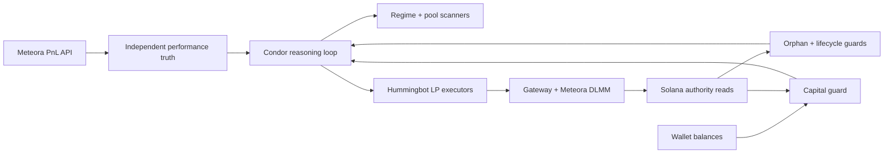

# Agent Builders Cup submission draft

## Portal fields

**Project name:** Regime LP Operator — Chain-Verified Meteora Agent

**One-line pitch:** An autonomous Meteora DLMM agent that adapts liquidity shape to market
regime and verifies every position against Solana before it trusts its own execution layer.

**Category:** Meteora trading agent / DeFi infrastructure

**Repository:** `TODO: add public fork URL before submission`

**Demo video:** `TODO: upload the final video and add a public URL before submission`

**Hackathon portal:** https://www.botcamp.xyz/hackathons/agent-builders-cup-1

## The problem

Most automated LP demos stop at pool ranking and transaction creation. The dangerous part
starts after that: an RPC read can fail, an executor can mark a still-funded position
complete, a stale cache can report closed positions as open, and a quote-only wallet view can
hide the token inventory returned by a DLMM close. Once the agent trusts any one of those
views, its sizing, stop-losses, PnL, and next trade can all be wrong together.

## The solution

Regime LP Operator is a three-sleeve Meteora agent running through Condor and Hummingbot:

- **Core:** SOL/USDC liquidity for calmer regimes.
- **Satellite:** gated SOL-quoted pools with bid-ask ranges, max holds, and recovery flips.
- **Runner:** young Meteora pools ranked by accelerating five-minute volume, strictly
  time-boxed and probe-sized.

The strategy changes range shape and width using measured volatility regimes, but its main
innovation is operational: every minute it reconciles chain positions, inventories the full
wallet, recomputes capital from actual USD equity, and evaluates exact position deadlines.
Market discovery stays on a five-minute clock so safety latency no longer depends on scanner
latency.

## What makes it different

1. **Chain truth over self-reporting.** A position is real only when Solana's owned-position
   read confirms it. Executor and cache data are candidates, not authority.
2. **Bidirectional verification.** Creates and stops are checked against both executor state
   and wallet/on-chain deltas. “Success” and “failure” are never accepted at face value.
3. **Actual-equity sizing.** The configured `$800` is a ceiling. The live guard measured a
   roughly `$77` book and converted the 6% daily loss rule from an unsafe `$48` assumption to
   about `$4.64`.
4. **Independent sponsor accounting.** PnL is reported from Meteora's DLMM API, not the
   executor layer. Missing fields remain unavailable rather than becoming zero.
5. **Failure evidence becomes product behavior.** The system detects phantom cache rows,
   ghost executors, true orphans, partial wallet reads, fabricated zero-proceeds closes,
   deadline drift, and material inventory fills.

## Architecture

## Live evidence snapshot

Observed on Solana mainnet on 20 August 2026 around 17:10 UTC. These are a point-in-time
engineering snapshot, not a promise of future returns.

| Check | Observed result |
|---|---:|
| Effective equity | about $77.30 |
| Liquid quote before reserves | about $40.68 |
| Open LP value | about $36.62 |
| On-chain positions / RUNNING executors | 2 / 2 |
| Orphans / ghosts | 0 / 0 |
| Stale phantom-cache rows safely ignored | 30 |
| Meteora lifetime book PnL | **-$2.8245 (-0.405%)** |
| Current SOL/USDC position | +$0.1392 (+0.696%) |
| Current XST/SOL position | +$0.1457 (+0.892%) |

The negative lifetime result is intentional to disclose. This submission is not a cherry-picked
profit screenshot. It demonstrates a system that found its own accounting and execution
failures, turned them into deterministic guards, and can now scale only when observed risk
supports it.

## Technical stack

- Condor agent loop and auto-discovered Python routines
- Hummingbot API and LP executors
- Hummingbot Gateway with Meteora DLMM and Jupiter routing
- Solana mainnet authority reads
- Meteora DLMM data API for independent PnL
- GeckoTerminal OHLCV and fresh-pool feeds
- Pydantic configuration and pytest regression tests

## Current limitations and next work

- Two close-path defects are upstream: transient position reads can skip a close, and a
  pending Gateway response can be booked with zero proceeds. The agent has local detection,
  on-chain reconciliation, and recovery behavior; upstream reports are drafted separately.
- Meteora's current PnL response leaves some deposit/withdrawal fields unavailable, so
  vs-HODL is reported only when it is computable.
- A public repository URL and uploaded demo URL are the two external submission steps still
  required. They must not be fabricated or replaced with local links.

## Links

- Agent README: `agents/meteora_regime_lp/README.md`
- Strategy: `agents/meteora_regime_lp/strategies/regime_lp_operator/strategy.md`
- Demo script: `hackathon/demo-script.md`
- Submission preview: `hackathon/submission.html`

